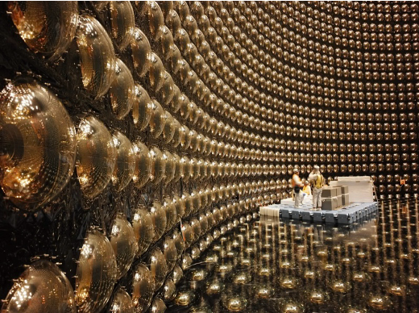

## はじめに

私達の体や家などの物は、全て「物質」でできています。宇宙ができた時、その「物質」とともに、真逆の性質を持つ「反物質」が生まれたとされています。ここで、反物質の性質として、物質と反物質が互いにぶつかると、光になって消滅します（対消滅と呼ばれています）。ここで、反物質と対消滅ついて少し解説しましょう。

(1) 反物質とは

反物質とは、粒子が帯びる電気のプラス・マイナスが通常の物質と比べて逆の物質です（電気を帯びていない粒子は粒子の自転方向が逆です）。

(2) 対消滅反応とは

物質と反物質が出会い、莫大なエネルギーが放出され、互いの物質が消滅する反応が対消滅反応です。この反応は、アインシュタインが導いた有名な式、『$E=mc^2$』を体現する反応です。$E$はエネルギー、$m$は質量、$c$は光速（一定）を表していて、質量はエネルギーに変えることができることを表しています。対消滅反応と他の反応との圧倒的な違いは、反応により放出されるエネルギー量が莫大であるという点です。つまり、質量を全て消費して消滅する代わりに、莫大なエネルギーを生み出すことができる反応です。この時発生するエネルギーは、燃焼で生み出すことのできるエネルギーを1とすると、それで生み出すエネルギーは30億です。

## 反物質と私達の存在

ここまで反物質について解説しましたが、実はまだ反物質の存在はほとんど観測されていません。今でも、反物質が存在するかどうかを確かめる実験がされています。ここで、なぜ反物質が研究されているかというと、先ほど宇宙が生まれた時物質と反物質が生まれたと話しましたが、物質と反物質がセットで生まれたとすると今の我々は対消滅によって存在しないことになります。したがって、反物質について研究することは、今の我々が宇宙で存在できる理由が明らかになるということです。物質と反物質の違い（CP対称性の破れと呼ばれる）を実証すると、宇宙で物質が存在することを説明できるかもしれないのです。そこで、まず実験の対象となったのは、人類が加速器を使って人工的に生み出した素粒子の一種である「ニュートリノ」です。

## ニュートリノとは

ニュートリノとは、私達の周りにも存在している素粒子で、私達の体をも通り抜けるほど小さいものです。また、宇宙は1ccあたりだいたい300個ぐらいのニュートリノが存在しています。これは、500mlペットボトルの中に15万個ほどのイメージです。

ニュートリノは素粒子の一種ですから、ニュートリノの反物質である「反ニュートリノ」が存在します。そこで、現在はニュートリノとその反物質である反ニュートリノの違いを示すことで物質と反物質による対消滅を説明できると考えられ、研究の対象とされています。

具体的には、ニュートリノの状態が変化する時、どの物質に変化するか、物質と反物質でその割合が違うことを、300km離れた「スーパーカミオカンデ」（上写真）で捉えようという実験です。実は、ニュートリノというのは「電子ニュートリノ」「ミューニュートリノ」「タウニュートリノ」の三種類があり、「ニュートリノ振動」によってその種類が変化します。これは1998年にスーパーカミオカンデで発見された現象です。ちなみにこの時、ほんの小さなニュートリノに、わずかな質量があることが分りました。この功績は後にノーベル物理学賞を受賞することとなります。しかし、未だにその軽さの理由は証明されていません。この実験は「T2K実験」と呼ばれ、現在では95%の確からしさで物質と反物質の違いがあることが発表されました。

## 最後に

現在では、95%で違いがあることがわかっていて、さらに高精度で違いを観測しようと実験が進められています。反物質について解明することは、今の宇宙で私達が存在できることを説明できるようになる大きな1歩となります。現在、宇宙の95%は未知であると言われています。反物質は宇宙の解明の手助けにもなるかもしれません。

## 参考文献

- [「なぜ宇宙には物質が存在しているのか？」実は現代の物理学でも説明できない究極の謎だった…素粒子実験の第一人者が語る「ニュートリノがなければ人類も誕生できなかった」という不思議（サイエンスZERO） - 2ページ目 | 現代ビジネス | 講談社](https://gendai.media/articles/-/107706?page=2) 
- [ニュートリノって何？ | スーパーカミオカンデ 公式ホームページ](https://www-sk.icrr.u-tokyo.ac.jp/sk/neutrino/about/)