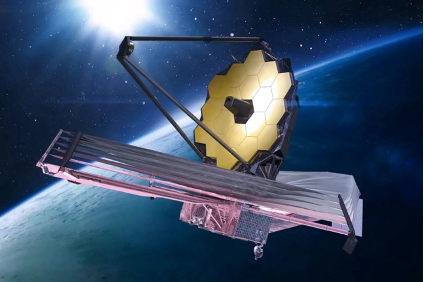

import Blackhole from './blackhole.astro';

タイムトラベルなんてできるわけがない。あんなのSFの妄想だろ！(SFだけに)と思っている人は多いと思います。僕もタイムトラベルができている世界なんてとても想像できません。あと数十年後にはできているかもしれませんが。しかし今回ブラックホールについて調べて少し実現可能かもな、という気がしてきました。

## ブラックホールの基本情報

ブラックホールとは、全質量が中心に集まった強大な重力を持つ天体です。そのため、光さえも飲み込んでしまいます。真っ暗のように見えるのはそのためです。ブラックホールの密度は質量が大きいと小さくなるので常に高密度というわけではありません。質量が集中している点を特異点と呼びます。特異点の中がどうなっているかはわかっていません。質量が比較的小さなものでも無理やり押しちぢめることができれば、ブラックホールを作ることは可能です。もしもの話ですが、地球がブラックホールになったとしたら、半径はどのくらいになるでしょうか？答えは9ミリです。1円玉が１センチなのでそれよりも小さいことになります。

## ブラックホールの歴史

昔は誰もがブラックホールを理論上の存在にとどまり、実在しないと考えられていました。

しかし、1930年代になると20歳のインド人学生、スブラマニアンチャンドラセカールが白色矮星の質量が太陽の1.46倍になると半径がゼロの星になると主張しました。これはまさしくブラックホールの存在を予言していました。白色矮星とは、密集した電子に支えられている星で、密度が非常に高く、１立方センチメートル当たり1トンになるものもあります。なお太陽は、密度が150グラムほどです。めっちゃ重いやん、って思いますが、壮大な宇宙なので我々の感覚とは違うのだなということを痛感します。太陽の1.46倍の白色矮星は見つからなかったもののブラックホールの研究を発展させました。同じころ中性子性が見つかり、太陽の3倍の質量を超えると重力破壊が無限に続くということが判明しました。これがブラックホールです。 

## 近年のブラックホール研究

まず、すべての物質は電磁波というものを出しています。高いエネルギーがかかわる現象程波長の長い電磁波を出します。ブラックホール自体は電磁波を外に出しませんが、周囲にある連星(平たく言うと近くにある星)などは高エネルギーの現象が起こっているため、X線での観測が有効です。X線は地上に届かないため、宇宙望遠鏡で観測します。近年たくさんのブラックホールが発見されています。

## ブラックホールの面白い利用

１つ目は、ごみ処理とエネルギー獲得です。ブラックホールには回転するものとしないものがありますが、するものにはエルゴ領域といわれる部分があります。簡単に言うとエルゴ領域(エルゴ球)とは、ブラックホールに引きずられて静止できない空間です。

1. エルゴ球にごみを落とす
2. ブラックホールの逆方向にごみを放り出して入れ物を回収する
3. ブラックホールの回転がわずかに遅くなり、その回転エネルギーをもって入れ物が出てくる

夢のような話ですが、ブラックホール超未来都市のエネルギー獲得とごみ処理のイメージです。

2つ目は、タイムトラベルです。

相対性理論によって、ブラックホールとともにホワイトホールとワームホールというものの存在が予言されました。まだ見つかってはいませんがブラックホールは発見されているため、見つかる可能性はあります。ホワイトホールとは、ブラックホールと時間をひっくり返した関係になっています。例を挙げるとボールを投げ上げて落下するまでの様子をビデオで撮ったとき、逆再生しても物理的法則に反していません。つまり、ホワイトホールとは、内部の特異点に存在している物質を物質や光などとしてはきだし、何物もその内部にとどまることができない天体です。ワームホールとは、ある空間と別の空間をつなぐ抜け道のような構造をしていて、潜り抜けると一瞬にして別の天体に移動するというものです。ブラックホールとホワイトホールを結ぶ構造をワームホールの１種と呼ぶこともあります。ワームホールは非常に不安定な構造をしているといわれており、実際に物質や光が通り抜けようとするとエネルギーバランスが崩れ、つぶれてしまうと考えられています。

ブラックホールとホワイトホールをつなぐものは、ブラックホール側からホワイトホール側へ移動することはできても、ホワイトホールからブラックホールへは移動ができないため、戻ってくることはできませんが、一方通行ではないワームホールが存在すれば、理論上空間の壁を超えることができます。ワームホールを維持するためには、負の圧力を持った物質が必要のようです。負のエネルギーを持った物質は、通常の物質とは逆で、空間を押し広げようとする性質を持っています。ただ、この物質は、理論上の存在でありどうやって作り出すのかはわかっていません。しかし、量子論によると微小な世界では、あらゆる空間は一定にとどまっていることはなく、ワームホールが瞬間的に生成、消滅を繰り返しているらしいです。このワームホールをおおきくして、安定させることができれば、タイムトラベルができるかもしれません。

<Blackhole />

また、我々が住んでいる宇宙を高次元空間に浮かぶ膜のようなものとしてみると向こうには別の宇宙が存在しており、膜同士が接触したときにワームホールが形成される可能性があるといいます。

## 感想

調べてみて思ったのがとにかく難しかったです。理解できなかったことが多くありましたが、前よりも知っていることが増えたし、天文をより好きになりました。ロマンがあって楽しかったです。