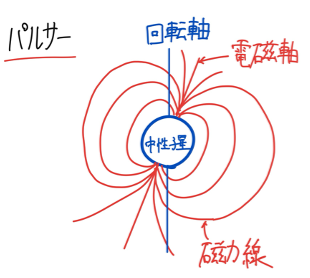
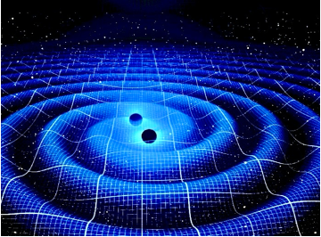
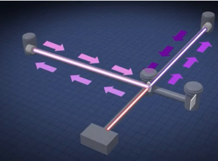
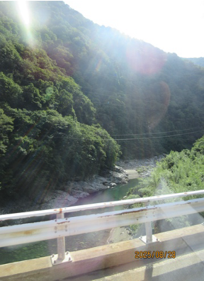

宇宙には現在の科学技術でも数え切れないほどの無数の星があります。ですが、その星たちにも寿命があります。ではその星たちが寿命を迎えたらどうなるのでしょうか。今回は、そんな星たちの最終形態について紹介したいと思います。

## 中性子星とは

題名には「星の最終形態　中性子星」と書きましたが、実際には、星の最後は元の星の質量によって異なります。太陽の約8倍以下の質量である星は、寿命を迎えると内部は「白色矮星」、外側は「惑星状星雲」となって広がります。逆に太陽の約8倍以上の質量である星が寿命を迎えると、超新星爆発(ベテルギウスがするかも．．．という話でおなじみかと思います)起こした後に「中性子星」となります。また、さらに重い星の場合は「ブラックホール」(これもSF映画などでよく出てくる？のでなじみがあるかと思います)となって残る可能性もあります。(中性子星として存在できる質量の限界は、理論的には太陽の⒈5倍〜2.5倍の質量までで、実際2倍程度の中性子星も発見されています。)

中性子星は文字通りそのほとんどが中性子で構成されています。直径は20km程度で大気の厚さは1mしかないにもかかわらず、質量が太陽程度もあり、そのため密度は宇宙で最も高く、太陽の10^14倍以上もあるので表面重力は地球の表面重力の$2×10^{11} $倍ほどあるとされています。また、中性子星に強い磁気があり、この時に磁極を結ぶ直線が自転軸と一致していない場合、パルサーと呼ばれる天体になります。パルサーとは、パルス状の可視光線、電波、X線を発生させる天体で、「自転のエネルギーによるパルサー」と「X線パルサー」と「マグネター」の3種類があります。これらは灯台のように非常に安定した周期でパルスを放射するため、「宇宙の灯台」とも呼ばれています。

## 連星中性子星について

連星は、お互いが重力で結ばれていて、共通の重心のまわりを公転しているものを指します。公転運動をしているため、長い年月を経て位置関係が変化します。公転周期は人間の寿命よりも長いものがほとんどです。この、互いに公転する星が中性子星であるものを「連星中性子星」と呼びます。連星中性子星は公転しながら「重力波」([研究への有用性](#研究への有用性)で説明します)と呼ばれる波を放出して徐々にエネルギーを失い、互いに接近していきます。そのため、さきほど“太陽の約8倍以上の質量である星の最期は中性子星“と言いましたが、連星中性子星は最終的に合体してブラックホールを形成すると考えられています。

## 研究への有用性

中性子星、特に連星中性子星は、さまざまな学問分野で研究対象となっていますが、ここでは連星中性子星が研究に関わっている「重力波」の研究について紹介したいと思います。

なぜいきなり重力波の話をするかと言いますと、（~~思ったより中性子星について話すことがなかったからではなく、~~）今夏、学校主催のサイエンスツアーという企画で、岐阜県飛騨市神岡町で「重力波」の研究をしている「KAGRA」という施設を見学させていただいたからです。なので、ここからは（題名は中性子星ですが）「重力波」と「KAGRA」について書こうと思います。

「重力波」とは、アインシュタインが存在を予言したもので、質量を持った物体が加速度運動をすることで必ず発生する波のことです。（僕たちがトランポリンに乗ると沈み、跳ねると揺れますよね。だいたいそんな感じです。）なので、僕たちが手を振ったりするだけでも重力波は発生しています。ただし、人類が検出できそうなほど大きな振れ幅の重力波を放出するのは、高密度で非常に大きな質量の物体同士がお互いの周りをまわって合体したり、吹き飛んだりするといった時です。この現象を起こす例として挙げられるのが、連星中性子星です。連星中性子星の合体では非常に大きな振れ幅の重力波が放出されるため、観測しやすくなります。また、合体の直前に、強力な重力で星は大きく歪められます。この歪みが重力波の波形に与える影響から、その中性子星の構造なども知ることができます。この他に、超新星爆発などでも非常に大きな重力波が放出されます。また、重力波の存在も、連星中性子星（連星パルサー）の公転周期が年々短くなることの原因として、連星の回転エネルギーが重力波放射によって失われるということを示唆する観測結果が出たことが間接的証拠となりました。

ここまで重力波の説明をしてきましたが、「結局なんで検出したいん？」ってなりますよね。検出のまず一つ目の目的として、アインシュタインが100年前に唱えた一般相対性理論が正しいかを検証するため、というものがあります。そして2つ目に、検出できるくらい大きな重力波が放出されるのは宇宙の“重大イベント“の時だけであるため、検出できれば超新星爆発などにいち早く気づくことができ、重要な天体現象を見逃しにくくなる、ということがあります。その他にもメリットはたくさんあり、検出は他の分野の発展にも貢献するようです。

重力波の検出には、世界各国が協力しており、日本では「KAGRA」がその検出に尽力しています。2015年にアメリカの「LIGO」が世界で初めて検出し、その後も各国が検出に尽力しています。また、世界各国で共同観測することは、“検出する目的“を達成する上でも欠かせません。もし共同観測で複数地点で同時に重力波を検出できた場合、到達時間の微妙なズレからその重力波がきた方向、つまり重大イベントが起こった方向を特定することが可能となります。

ここからはそんな「重力波」を観測する「KAGRA」について書きたいと思います。「KAGRA」は、岐阜県神岡町の池ノ山（かの有名なカミオカンデがある山と同じ山です！）の地下に設置された日本の重力波観測装置です。

### KAGRAの仕組み

X字型に1本3kmのアームを用意し、二本のアームが交わる場所と両アームの片方の端に鏡を設置します。そして片方のアームの足からレーザー光を発振し、真ん中の鏡で2つに分かれ、その後反射されて戻ってきた光は混ざり合って干渉し、その干渉した光を検出しておきます。この状態で重力波の到来を待ち、到来するとアームの長さが変化し、干渉した光の強さが変化します。

### 装置

少しのノイズが大敵となるので東京の1/100H zのノイズしかない神岡の地下に建設されました。また、鏡は地面からの振動が伝わらないよう、振り子のように吊るされており、空気でレーザー光が揺らいでもいけないので、装置自体は真空槽に入っています。その他にも工夫があり、その鏡にはサファイアが使われており、サファイアが最も硬くなる-253℃の状態で使用されています。近年は、光が散乱しにくくする迷光対策や、より鏡を制御できるようにするなどアップグレードが進んでいるようです。また、感度はアームの長さに比例するのでできるだけ長くしたいですが、長くしすぎると地球の丸みを無視できなくなるため、地理的な都合上10kmが上限だと言われています。

アームに関しては、中に異常があったとき、アーム内は真空で3kmもあるので、区切っていないとアーム内全体に空気が入るまで待つ必要があり、対処までに非常に時間がかかります。そのため、アームが定期的に区切られています。

## 最後に
長々と小難しい内容を書いてきましたが、僕もこの内容は前述のサイエンスツアーで初めて知りました。今年はKAGRAの他にも、カミオカンデなどの施設も見学させていただきました。この部誌を読んでくださっている人の中で、星光を受験する人がいれば、ぜひ入学してサイエンスツアーなどの面白い企画にぜひ参加してみてください。そのほかの方々も、これを読んで少しでも「重力波」などの内容に興味を持っていただけると幸いです。

最後までお読みいただきありがとうございました。

## 参考文献
- [Wikipedia](https://ja.wikipedia.org/)
- [重力波とは ｜ 国立天文台 重力波プロジェクト](https://gwpo.nao.ac.jp/about_gw/)
- [パルサー | 天文学辞典](https://astro-dic.jp/pulsar/)
- [宇宙で最強な磁石天体が、磁力でわずかに変形している兆候を発見 | 東京大学](https://www.u-tokyo.ac.jp/focus/ja/articles/a_00269.html)
- [連星中性子星合体からの重力波が初検出されました ｜ ニュース ｜ 国立天文台 重力波プロジェクト](https://gwpo.nao.ac.jp/news/000034.html)
- [KAGRA 大型低温重力波望遠鏡 – KAGRA 大型低温重力波望遠鏡のホームページです。](https://gwcenter.icrr.u-tokyo.ac.jp/)
