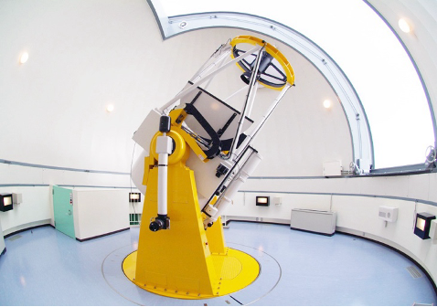
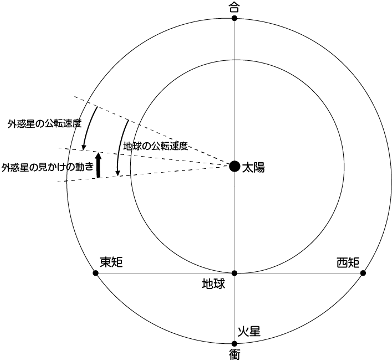
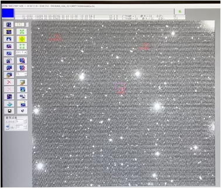
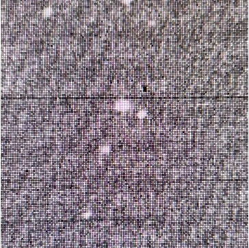
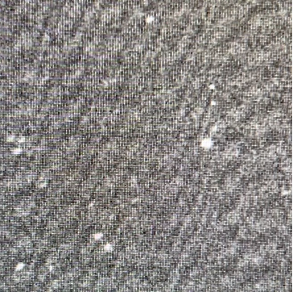

## 前書き

前書きを書くのは、ラクダが針の穴を通る(聖書引用)よりも難しいことだと個人的には思っている。この原稿では石垣島で開催している天文合宿“美ら星研究探検隊「新しい星を見つけよう！」”で実際に行った研究内容を論文っぽく仕上げてみたという感じだ。題名から分かる通り他の原稿と異様な威圧感を放っているのは承知だが、実はあまり難しいことは書いていない…はず。この原稿の題名を簡単に言えば、「高性能な望遠鏡を実際に動かしてまだ誰にも見つけられていない小惑星を探そう！」ということだ。実際にそういった小惑星を発見したか否かはこの原稿のまとめの部分が一番わかりやすく書かれていると思う。では、本編をどうぞ。

## 小惑星

1. 小惑星とは

    小惑星とは、太陽の周りを公転する天体のうち、惑星や準惑星及びそれらの衛星を除いた小天体を太陽系小天体と呼び、それらのうち主に火星と木星の間の小惑星帯(メインベルト)にあり、木星の軌道及びそれより内側にある小天体のことを指す。小惑星は軌道長半径によって、メインベルト小惑星、トロヤ群小惑星、及び地球接近小惑星に大別される。小惑星の中には似通った軌道要素をもつグループに分類できるものがあり、これを小惑星の族という。大部分の小惑星は惑星のような熱進化を経験していないと考えられるため、太陽系形成初期に関する貴重な情報源となっている。［1］

2. 小惑星の発見から命名まで

    もし仮に未同定小惑星候補を発見できたならば、パーソナル符号といった独自に付けた7文字の名前を小惑星の軌道を管理する国際的機関MPC (Minor Planet Center)に報告することになる。そして、パーソナル符号でMPCに観測報告を行った小惑星に対して、複数日以上で追観測に成功した場合、その小惑星には仮符号という仮の名前がMPCによって割り当てられる。これは軌道がまだ正確に決まっていない小惑星につけられる整理番号だ。この仮符号のついた小惑星に対し十分な追観測が行われ、確かな軌道が得られるとその小惑星には通し番号がつけられる。これを確定番号といい、MPCによって決められる。

    ここからは命名についてだ。確定小惑星となった時点で初めて正式なら発見となり、発見者が決定される。発見者になると、その小惑星の名前を国際天文学連合（IAU）に提案する権利を得ることができる。そして、IAUから承認が得られると、晴れて命名となる。［2］

## 目的

現在、小惑星は130万個以上発見されており、小さい小惑星ほど数は多くなるが暗く、年々発見が難しくなっている。しかし、先程にも述べた通り太陽系の進化を解明するためには、小惑星の発見は非常に重要である。そこで、我々は口径105cm、限界等級約21等級である石垣島天文台の「むりかぶし望遠鏡」(写真１)を用いて未知の小惑星を発見しようと考えた。

## 方法

1. 探索方法

    小惑星の探索はできる限り明るい方が見つけやすい。したがって、小惑星と地球との距離が一番近い衝（写真２、小惑星の衝の画像を発見できなかったので、火星の衝の写真を使用）の時を狙って観測を行う。

    
     

    1.  衝の座標を太陽の座標から割り出しその付近の小惑星を探す。 
    2.  中心を0として一つあたり0.2°角×0.2°角の領域を9つ決定し、それぞれ3分×8枚を撮像。(MITSuME 3色同時撮像カメラで連続撮影する。但し、高感度、高S/N比のためRのみ分析) 
    3. 小惑星探索ソフトを用いて画像の分析を行う。［3］

2. 分析方法

    

    小惑星探索ソフト(写真３)内にある高速ブリンク法を用いて小惑星を探索する。高速ブリンク法というのは、何枚かの写真を高速でコマ送りにする方法である。その方法を用いて周囲の星に対して移動している天体は小惑星の可能性が高い。しかし、ノイズや残像などが分析の阻害要因になったりする。ノイズとは、写真４のようなもので、一本の黒線が入っているのが分かるであろう。それがノイズだ。また、残像とは、写真５のことをいい、そういったものを目視で省きながら、小惑星の探索を行った。

    
     
    
     

3. 観測日程

    当初の予定では、悪天候が予想されていたため、8/3，8/4にも事前にバックアップ観測を行った。しかし、予想に反して良好な天候となったため、計4夜の観測を行うことができた。

## 結果

観測の結果、以下の2天体を新天体候補とした。

1. 初観測：2024年8月4日 00:01:36.7（JST） 
    →追観測を行い、MPCへの報告。2013 VX90［4］と判明。この軌道長半径は、2.4660505AUであった。

2.  初観測：2024年8月5日 02:38:18.0（JST） 
    →追観測を行い、MPCへ報告。2024 OF10［5］と判明。この軌道長半径は、2.5567429AUであった。

## 考察

1. 2つの新天体候補を発見できた要因

    - 全体的に天候に恵まれ、結果的に4夜の観測ができ、また衝の位置に近い領域を観測できたこと
    - 小惑星の自転による増光と観測のタイミングがたまたま一致したために検出できた可能性も考えられるということ
    大気の揺らぎや光害の影響が少ない石垣島で観測できたこと

2.  観測領域の中で小惑星が発見される割合

    観測した新天体候補の数を観測した領域数で割った値は、2/24＝0.1個/1領域だった。今後の観測の際も、この値を計算して比較することで、観測されやすい条件の発見に繋がる可能性がある。

3. 観測された新天体候補についてわかること
    - 追観測の間隔が短いため、小惑星の軌道決定を行うにあたって、非常に重要なデータとなる可能性が高いということ
    - 今後、分光観測を行うことで、小惑星タイプを特定することができるということ
    - 特に、2013 VX90の軌道長半径は2.47AUとされており、小惑星の数が極端に少ないギャップ地点に位置しているため、今回の観測は重要なものであるといえるということ
    - 2024 OF10は小惑星の数が多い地点に位置している。この地点には様々なタイプの小惑星が存在するため、小惑星タイプを調べることで、太陽系の進化を探るにあたって重要なデータとなる可能性があるということ

## まとめ

2つの新天体候補を発見したが、既知のものであったため、仮符号を取得できなかった。

## 参考文献

［1］[小惑星 | 天文学辞典](https://astro-dic.jp/asteroids/) 
［2］[小惑星を発見するには？ | COIAS](https://web-coias.u-aizu.ac.jp/details/procedure) 
［3］小惑星を探そう―探査編―，財団法人　日本宇宙フォーラム 
［4］[2013 VX90 | IAU Minor Planet Center](https://www.minorplanetcenter.net/db_search/show_object?utf8=%E2%9C%93&object_id=2013+VX90) 
［5］[2024 OF10 | IAU Minor Planet Center](https://www.minorplanetcenter.net/db_search/show_object?utf8=%E2%9C%93&object_id=2024+OF10)
