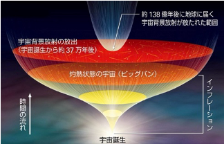
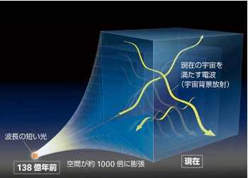
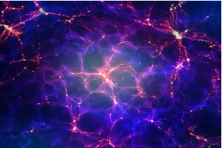
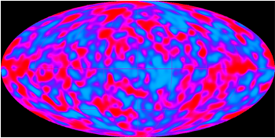
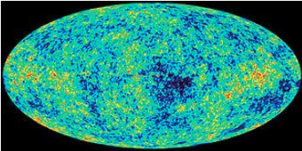
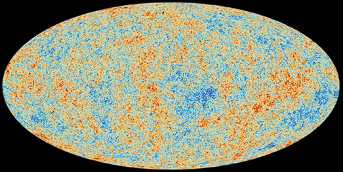
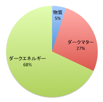
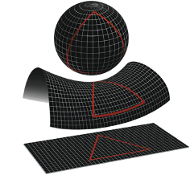

## はじめに
現在の宇宙論は「小さな灼熱の宇宙が大爆発をおこして誕生した」という「ビッグバン宇宙論」がベースとなっている。この理論の裏付けとなるのが「宇宙背景放射」である。宇宙背景放射とは、大昔の宇宙が高温であったため宇宙全体が光り輝いていた、そのときの光のなごりである。これは宇宙空間で星も何もない「背景」から放射されることから、宇宙背景放射と呼ばれている。この宇宙背景放射がどのように生まれたのかやこれによって明らかになったことなどを紹介する。

## 宇宙の始まりと宇宙背景放射の成り立ち
宇宙背景放射の成り立ちを書く前に宇宙の始まりを書きたいと思う。ただ宇宙の始まりはビッグバン以前はあまり解明されていないため、今考えられている定説をもとに紹介する。

宇宙は「無」から始まったと言われている。ここでいう「無」とは「空間からあらゆる物質や光などを取り除き、その空っぽの空間の大きさを限りなくゼロに近づけたもの」である。この「無」がごく小さな宇宙に変わることで宇宙は誕生したのである。誕生したごく小さな宇宙が何らかの影響でインフレーション（超急膨張）が始まりビッグバンの状態になった後、緩やかに膨張を続け現在の宇宙になったと言われている。インフレーションとは光速を超えるほどのスピードでごく短時間におきた加速加熱膨張のことである。またビッグバンは「膨張する灼熱状態の初期宇宙」と考える。宇宙がビッグバン状態であったとき、あまりにも灼熱のため、原子核や電子が原子を構成せずそれぞれ単体で飛び交うプラズマという状態になっており、光が直進できなかった。（霧が立ちこめている状況とイメージは同じである）ただ、時間の経過とともに宇宙は膨張し温度が下がり、原子核と電子がまとまって原子となったことで宇宙が晴れ上がり、光が通ることができた。この宇宙最古の光のことを宇宙背景放射という。ちなみに、この光は電磁波である。ここから光と電磁波両方の形で述べるが、同じものと考えてほしい。

## 宇宙背景放射の発見
宇宙背景放射は、1964年天文学者アーノ・ペンジアスとロバート・ウィルソンが電波望遠鏡を使って天体観測を行おうとしたときたまたま「雑音」として観測されたのが始まりである。これは宇宙のどこでも（星も何もない場所でも）望遠鏡を合わせると同じように観測できたため、ビッグバンのなごりである宇宙背景放射なのではないかと考えられたのである。

 

観測が進んでいくと、宇宙背景放射の波長が2mmほどの「マイクロ波」であることがわかった。ちなみに携帯電話や電子レンジで使われている電波の波長は10cmである。少し話は変わるが、あらゆる物質はその温度に応じて電波や光を発している。具体的には、低温の物質は波長が長い電波を多く出し、高温の物質は波長の短い電磁波を多く出している。このことから話を戻すと、観測した電磁波はとても波長が長く、−270℃の物質が出す電磁波とほとんど同じなのである。また、これは宇宙のどこでも（星も何もない場所でも）望遠鏡を合わせると同じように観測できたため、

なぜビッグバンという超高温状態から放たれた光なのに現在−270℃であるのだろうか。これは宇宙の膨張が関係してくる。電磁波は空間の電場と磁場の振動が周囲に伝わっていく現象である。つまり、空間そのものが振動して伝わる波なのである。この空間が宇宙の膨張によって引きのばされるので電磁波の波長も引きのばされ長くなったのだ。そのため現在は約3K（−270℃）の物質から出る波長の長い電磁波として宇宙背景放射は観測されるのである。

 

では宇宙背景放射はどのぐらい引きのばされたのだろうか。宇宙背景放射が出たときの宇宙の温度は約3000K（2727℃）だったと考えられている。そのため現在1000m分の1程の温度に下がったということになる。このことは波長が1000倍に伸びたことを表しているので、つまり宇宙の大きさが1000倍なったことを示しているのだ。

## 宇宙背景放射のムラの発見
宇宙背景放射を地上で観測するとどの方向に向けても「温度」は同じだった。ただ研究者たちは「宇宙背景放射が全方位に完全に均一に同じ温度で広がっているはずがない。どこかにムラがあるはずだ」と考えていた。しかし地上では大気によって電磁波の一部が吸収されるため精密な観測が不可能であった。そこで宇宙背景放射を観測するために作られた人工衛星「COBE」を1989年に打ち上げた。

 

宇宙には様々な恒星や惑星、星雲などが浮かんでいる。場所によって銀河などがたくさん集まっていたりあまりなかったりと多種多様なのだが、（宇宙の大規模構造）これこそが「宇宙背景放射の温度にはムラがあるはずだ」と考えられている理由であった。重さをもつ物質は万有引力を持っている。物質が多く集まっているところがあれば、周囲より少しだけ重力が強くなり、その周りに物質が集まってまた重力が強くなり…を繰り返し星が形成される。そうすると初期の宇宙で物質の分布に偏り（ムラ）がなかったら、物質も集まらず星もできないはずである。なので初期の宇宙に物質の偏りが存在したと考えられ、それによって宇宙背景放射の温度にもムラがあると考えられたのだ。ただそのムラは地上では観測することのできない微小なものだった。

COBEはまず狭い範囲で宇宙背景放射の精密測定を行った。その測定結果は理論的な予測とほぼ一致するものだった。次にCOBEはあらゆる方向の宇宙背景放射の強さを観測する作業が行われたのである。

## 宇宙背景放射の観測

 

1992年、COBEの観測チームが全天の観測結果を発表した。上にある画像がCOBEの観測結果である。色の違いは宇宙背景放射の温度のわずかな違いを強調して表したものである。やはり宇宙背景放射にはさざ波のようなわずかなムラがあったのである。COBEの観測結果は、のちに宇宙のすべての星々をつくることにつながる不均一な物質の分布の証拠をはじめて捉えたものであった。つまり「宇宙最古の光」を観測してつくられた「最古の宇宙の姿」だと言えるのだ。

COBEの観測結果を見てみると、宇宙背景放射の温度差が赤と黒で強調して描かれているが、実際は高温部（赤色の部分）では平均より0.00001Kほど高く、低温部（青色の部分）では平均より0.00001Kほど低いだけなのである。

COBEの後もより精度と感度を向上させた宇宙背景放射の観測機が打ち上げられた。2001年にはNASAが「WMAP」、2009年にはESA（ヨーロッパ宇宙機関）が「Planck」を打ち上げた。WMAP、Planckの観測結果はそれぞれ下の画像の通りだ。温度差を表すために用いられている色こそ違うが、いずれも全天の宇宙背景放射の温度を観測したものである。また、新しい衛星ほどより細かい温度差のムラを観測できるようになっている。具体的には、COBEの観測精度（宇宙のどれだけ離れた角度を区別して観測できるか）は約7度（満月を14個並べた程度）だったのに対してWMAPは約0.2度、Planckは約0.08度とかなり細かく観測できるのである。

 

 

### 番外編
COBEの測定したムラでは、初期宇宙で物質の密度が高かった領域は温度が低く、密度が高かった領域では温度が低かったことがわかっている。一般相対性理論によると、物質密度が高い領域からくる光は重力の影響でエネルギーを少し失い宇宙背景放射の温度が少しだけ低くなる。このようにして宇宙背景放射にムラができるのだ。

## 宇宙の成分や年齢、形
宇宙背景放射は宇宙誕生直後の宇宙の情報をそのまま地球に届くのみならず、宇宙のこれまでの歴史を経験した上地球に届く光でもある。そのため、宇宙背景放射を観測することで宇宙の「生まれ」と「育ち」に関する様々な情報を得ることができる。

たとえば、宇宙背景放射の観測データから宇宙の成分の内訳を求めることができる。宇宙背景放射は「[宇宙の始まりと宇宙背景放射の成り立ち](#宇宙の始まりと宇宙背景放射の成り立ち)」で書いた通り、電子や陽子などが自由に飛び交うプラズマ状態であった。このプラズマ状態の中でどれだけ電子や陽子などか含まれているのか（密度）で宇宙背景放射の波長は変わると考えられている。

 

宇宙背景放射を分析した結果、既知の物質（原子など）は全宇宙の成分のたった5％でしかなく、残りのうち26％が正体不明の物質「ダークマター（暗黒物質）」であり、69％は正体不明のエネルギー「ダークエネルギー（暗黒エネルギー）」とわかった。（Planckの観測結果から）ダークマターやダークエネルギーの「ダーク（暗黒）」とは「目に見えない、正体不明の」という意味で、様々な観測データから宇宙には人類の知らない未知の物質やエネルギーが大量に存在すると考えられている。これは観測結果から何か重い物質がないと成り立たないという考察がなされているからである。このような物質やエネルギーがいまだに直接観測されていないため、こう呼ばれている。

また、宇宙背景放射を分析することから、宇宙の年齢も調べることができる。宇宙背景放射によって宇宙の年齢を導き出す原理はシンプルで、「距離÷速さ＝時間」なので宇宙背景放射が発せられた場所から地球までの「距離」を宇宙背景放射の進む「速さ」で割れば、かかった「時間」つまり宇宙の年齢を求めることができる。宇宙背景放射は電磁波なのでその速さは常に一定（秒速約30万km）なので距離がわかれば良いが、実際の大きさがわかっているものを使えば見かけの大きさとの比率から距離を割り出すことができることから計算することができる。実際に宇宙背景放射の温度のムラの大きさは計算によって求めることができるため、ここでいう実際の大きさがわかるわけである。その結果、宇宙背景放射が放たれた光は、地球から約450億光年の距離にあることがわかった。$1光年＝光が1年間で進む距離$なので宇宙は約450億歳のように思えるが、本当は約138億歳である。こうなる要因は宇宙の膨張である。宇宙が膨張したことによって宇宙背景放射が旅した距離は約3.3倍に引きのばされていることがわかっている。その為$450億光年÷光速÷3.3＝138億光年$となるわけである。

さらに宇宙の形も調べることができる。今人類が観測できる範囲でh宇宙は平ら（曲率がゼロ）なのだという。しかし宇宙空間が曲がっていたら宇宙空間をはるばる旅してやってくる宇宙背景放射は曲がって見える。ただそのような曲がりは観測されていないが可能性はあるという。宇宙に光で三角形を描き内角の和が180度なのかどうかをみるのが1つの方法である。（内角が180度より大きいと球体、180度だと平面、180度より小さくなると鞍型のようになる）

## 最後に

ここまで宇宙背景放射について述べてきたが、この宇宙背景放射はビッグバン宇宙論に確証をもたらしただけでなく宇宙の成分や年齢、形などの様々な情報を僕たちにもたらしてくれている。また宇宙背景放射は宇宙の果ての話やインフレーションの話など宇宙の謎すべてにつながるものであり今後も宇宙論の世界で重要なキーとなるものであるので僕自身注目しているものの1つなのだ。（他には重力波やニュートリノなど調べたら面白いものがたくさんある）この話を読んで少しでも宇宙に興味を持っていただけたり、へえーと思っていただけたりしたら1天文ファンとしてとても嬉しい限りである。

## 参考文献

- ニュートン別冊　ゼロからわかる宇宙論　最新科学が描きだす138億歳の宇宙
- [宇宙マイクロ波背景放射(CMB) | 研究内容 | 名古屋大学 宇宙論研究室 (C研)](https://www.astro-th.phys.nagoya-u.ac.jp/c-lab/research/particular/CMB.html)
- [|　宇　宙　図　|　宇宙はどのように生まれたのか？](https://www.nao.ac.jp/study/uchuzu/univ02.html)
- [見えてきた「宇宙のはじまり」 | 東京大学](https://www.u-tokyo.ac.jp/focus/ja/features/f_00066.html)
- [COBE衛星 | 天文学辞典](https://astro-dic.jp/cobe-satellite/)
- [WMAP衛星 | 天文学辞典](https://astro-dic.jp/wmap-satellite/)
- [ISAS | 「我々の起源」の探索の果てへ / 宇宙科学の最前線](https://www.isas.jaxa.jp/j/forefront/2015/matsumura/02.shtml)
- [直径10億光年の「銀河の泡」 宇宙の超大規模構造を偶然発見 | Forbes JAPAN 公式サイト（フォーブス ジャパン）](https://forbesjapan.com/articles/detail/66153)
- [ダークマターとは - XMASS実験](https://www-sk.icrr.u-tokyo.ac.jp/xmass/darkmatter.html)
