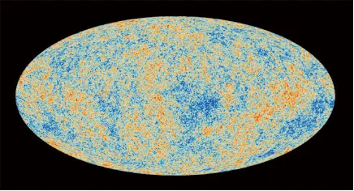
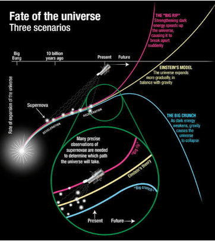

import {Image} from 'astro:assets';
import 真空の安定性 from './真空の安定性.png';

みなさんは宇宙の始まりはおそらくビッグバンから始まったということを知っているでしょう。それでは、宇宙はどのようにして終わっていくのでしょうか。この問題について長い間議論がされており色々な説が出ていますが、まだ定まっているわけではありません。宇宙の終焉について廃れたものも含めて、大きく分けると次の3つの考え方があります。

1. 宇宙は永遠に続いている
2. ビッグバンとビッグクランチ(一時的な宇宙のおわり)をくりかえす
3. 宇宙はいずれ永久に終わる

この3つをそれぞれ見ていきましょう。

## 宇宙は終わりを迎えることがない(定常宇宙論)
この理論は宇宙は永遠にあり続けるというもので1948年にフレッド・ホイルらによって提唱されたものです。結論から言うと、この説はビッグバンの存在がほぼ確定してから廃れていってしまいました。内容としては宇宙は膨張を続けているが、同時に物質を生成しているので宇宙は無くならないというものです。この理論を成立させるには物質を生成していることの観測が必要では？と思われるかもしれませんが、その必要はありません。水素イオンを一年間に1立方キロメートルの中に1つだけ生成されるような割合でもこの説は成り立つからです。しかし、先に触れた通り、この説はもう衰退してしまい、ほとんど信じられていません。

その理由となるのが、宇宙マイクロ波背景放射(1964年にの発見)です。これは今でもビッグバンが起こった証拠となっています。これについてはほかの頁で詳しく言及されているので長い説明は控えておきます。端的にいうと、ビッグバンがおわって少し(38万年)後に光が通りぬけられるようになり(宇宙の晴れ上がり)その時の光のことを指します。これが観測されたことで、ビッグバンは存在したことが示されて、同時に宇宙が永遠に存在するというこの考え方も否定されてしまいました。

## ビッグバンとビッグクランチを繰り返す(サイクリック宇宙論)
この論はサイクリック宇宙論と言われています。この論は1930年にアルベルト・アインシュタインが示した振動宇宙論という宇宙がビッグバンとビッグクランチを繰り返すことが永遠に続いていくという論を理論化したものです。この論が正しいと、宇宙は膨張を続けているが、いずれ引力によって収縮に転じていずれは崩壊してビッグバウンスがおきて、またビッグバンが起こるという具合に宇宙がつづいていきます。

しかし、この説は1934年にエントロピー増大の法則(外部からエネルギーを与えない限り無秩序さは自然と増大する(例・インクの拡散))によって否定されました。しかし、その後宇宙の膨張を現在加速させていると考えられている暗黒エネルギーの存在が示されて、今でもサイクリック宇宙論を支持している科学者は多くいて、その中には現在の宇宙は50回目くらいと予想する人もいます。

## 宇宙は永久に終わる
これには終わるシナリオがいくつかあります。
- 熱的死
- ビッグリップ
- 真空崩壊

これらを次は見ていきます。

1. 熱的死

    これは今あるどう宇宙が終わるかの予測で一番起こる確率が高いとされているものです。この説は1852年にケルビンによって提唱されました。余談ですがこのケルビンは絶対零度を基準とした温度の単位K(ケルビン)の由来になりました。熱的死をすると、宇宙で膨張が進みすぎることによって宇宙が絶対零度(前にも使いましたが、物質が熱運動していない、つまりこれ以上下げることのできない温度)に限りなく近くなり、宇宙全体が完全に均一化してしまいます。ちなみに、これが起こると言われているのは10の100乗年という途方もない年月がかかります。ちなみに、無量大数は10の68乗なのでこれは1無量大数年よりはるかに多いことになります。(どうでもいいことですが。)

2. ビッグリップ

    ビッグリップは2003年に公表されたもので、これは熱的死の次くらいに信憑性があるものとされています。ビッグリップでは、宇宙は最終的に引き裂かれて銀河も星も引き裂かれてバラバラになってしまいます。これが引き起こされる要因は、ダークエネルギーは宇宙を膨張させていますが、その密度が指数関数的に発散することで、そのエネルギーが重力を凌駕することです。もしこれが起こると原子までもが最終的に破壊されます。すばる望遠鏡から得られた情報によると、ビッグリップは少なくとも1400億年は起こされないそうです。

    

        上に行ってるのがビッグリップ 
        下に行ってるのがビッグクランチ
    

3. 真空崩壊

    このシナリオでは偽の真空という考え方です。つまり、本来自分たちが思っている「真空」は最低のエネルギーの状態ではなく「偽の真空」であり、さらにエネルギーを低い状態「真の真空」があるということです。これは仮説ではありますが、偽の真空が真の真空に移るために高いエネルギーかトンネル効果(大きなエネルギー障壁をトンネルを通るように通る現象)が必要になります。仮にどこかで真空崩壊が起こり真の真空の泡ができたとするとそれはますます膨張していってしまいます。また、その表面は高エネルギーなので触れたものは一瞬で崩壊してしまいます。また、泡は光速で膨張すると考えられています。なのでたとえ今どこかで真空崩壊が起こったとしても光速でしか進まないので宇宙の広さを考えるとここに到達するのはまだまだ先ということになります。
    <figure>
        <Image src={真空の安定性} alt='真空の安定性' class='反転' />
        <figcaption>真空の安定性</figcaption>
    </figure>
## 参考
- Wikipedia
- 天文学辞典
