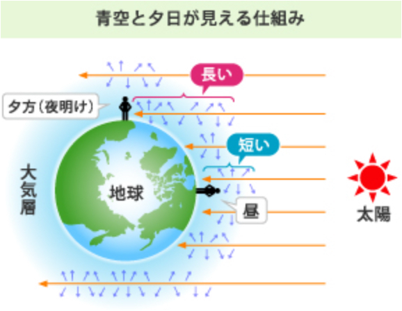

この章では「天体観測」について取り上げたいと思います。大阪星光学院を訪れてくださっている人の多くは大阪、兵庫などの都会に住んでいると思います。（ちなみにこの学校は奈良県民も多いのでその人たちを敵に回したことになるが。大阪府民は奈良は田舎やとばかにする、ほんと、それぐらいですよ。我々のレベルは。）全天のきれいな星空を見てみたい！って思っても、明るい星以外は見えないんですよね…「周りが明るすぎる」から。ここでは、天体観測に適した条件について少しだけかいつまんで解説しています。「そんなん当たり前の知識やわ！」って人は、どうぞ読み飛ばしていってください。あと脱線が嫌いな人も。脱線も含めて気ままに書いていく随筆スタイル（一流作家さんとは比較しないで）が僕は好みなんで。本題にはいる前に、これだけ説明しておきます。

### 「光の散乱」
文中では※のところに登場します。

光は、空気中の気体分子やちりなどにあたる、反射（はねかえること）と別に、光が散っていく現象がおきます。これを光の散乱と言います。大気中では青い光の方が、赤い光より散乱されやすいです。

「なぜ空は青いのか」という問いに、この散乱によるものです。上空で散乱された青い光が私たちの目に届いています。逆に、夕方などは、太陽光が地球の大気を通る距離が長くなり、青い光は私たちの目に届く前に散乱されてしまって見えません。代わりにあまり散乱されない赤い光が目に届いて、夕焼けは赤く見えるわけです。

また別の話ですが、塾とかでよく習う「プリズムに入れたら虹の色になって出てくる」っていうのは、「光の分散」という性質です。散乱と分散をごっちゃにしないように注意しましょう。（まだ散乱は知らなくていいよ。）

## 1. 暗いこと
今書いたやつですね。建物、街灯などの人工の光はもちろん、月明かりも結構じゃまになります。満月で月もきれいで観測日和だと言っているそこのあなた、それでは月周辺は全くと言っていいほど見えませんよ。なので、まずいわゆる田舎にいくことは大前提となります。やはり星々は遠くにあるものもありそこから地球に届く光は儚いものです。（これ、「はかない」って読みます。漢字かっこいいと思った人は~~高評価を~~）

## 2. 高い建物がないこと
全天を見るためです。ただえさえ光が小さいものですから、建物にさえぎられては損に感じるでしょう。これを最もよく満たすのは、「山の上」ですね。海抜レベル（山の方では海がないから「海抜」という言葉を用いない、はずです。知らんけど。）山の上などの標高の高いところは、大気の揺らぎ（温度にむらがあること）が少なく、光が散乱※しにくいです。知らなかった。都会から遠出して標高を昇る余裕のない方は高い塔の上でもさえぎるものは少ないはずです。

## 3. 空気が乾燥していて澄んで（すんで）いること
「澄んで」ってのも、いい表現ですね。文学的だ。乾燥してない、湿っていると、空気中の水蒸気がもや(靄)やきり(霧)が出てくる可能性があります。また水蒸気が多いと光が散乱※されやすく、ぼやけてしまいます。乾燥している季節は冬で、その時期は夏秋に比べて晴れていることが多いです。本校の天文部でも、1年に1回の天体観測合宿は冬にやっています（もっとも、この理由は先生の都合がつくのがこの時期しかないからですが。行けるなら春も夏も行きたい）

大きくはこの3つになると思います。それ以外で言うと、「周囲に熱源がない場所」…アスファルトやコンクリートなど、日中に熱をためこむ物体が近くにあると、夜間にその熱が上昇気流となり、空気を揺るがしてしまいます。あとは風（固定していたカメラ望遠鏡が動いてしまう）とかでしょうか。天気は残念ながら運次第なので、雨男の自覚がある人は厄祓いにでも行きましょう！

## おまけ
田舎に行くと街灯がありません。そしたら足元が見えないわけで、危険です。移動の時は懐中電灯くらいはいいやろと人がいるところで照らすと、これも観測の邪魔になりかねません。明るさレベルを落とすのはもちろんのこと、ある理由で「赤い」シートなどをつけるといいでしょう。これはなぜかというと、赤い光の方が暗順応（暗い場所で物を見えるようになること）から回復しにくい光だからです。暗い場所で物を見たりするのに目が慣れる現象を暗順応といいます。明るい部屋にいるとき、私たちの瞳孔（どうこう、目にある光を取り込む部分の名称です。）は光を取り込まないように小さくなっています。この状態から急に暗い場所に出ると、瞳孔が広がるまでに時間がかかるため、最初は何も見えません。

暗順応を妨げにくいのは、波長の長い赤色の光です。一方、携帯電話の画面から出ているのは青っぽい光で、波長が短くこの状況には適しません。（画面にも赤いビニールシートをつけましょう！ちなみにiPadなら設定で赤ライトにできます。これが赤シートに転用できるんだよね。）

そのため、寝る前に携帯電話を見るのは、目が冴えてしまい、睡眠ホルモン「メラトニン」の分泌を阻害してしまい、睡眠の質が低下します。（よく聞く話だよね、耳が痛い。）暗い場所で物が見えにくくなる原因にもなります。これは私自身もついつい門限を過ぎてもタブレットやスマートフォンを触ってしまい、終わったら布団直行して、質の悪い睡眠になると言う問題をかかえています。みなさんもスマートフォンとの付き合い方にはくれぐれも注意しましょう。という、天文関係ない話をしておいて、以上。お付き合いいただきありがとうございました。