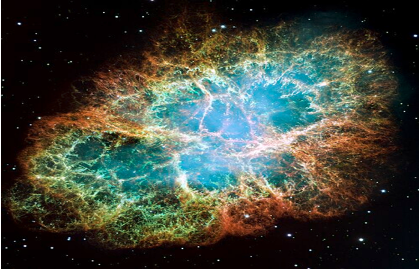
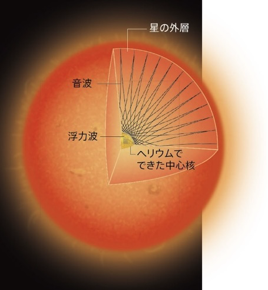
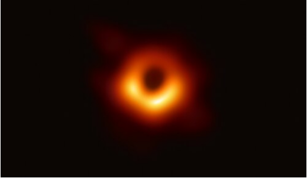
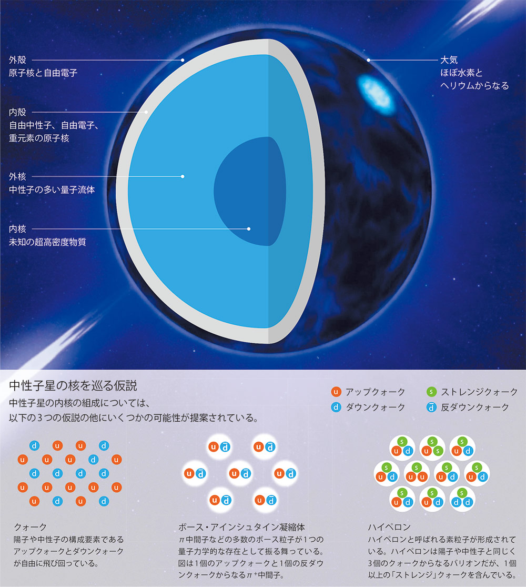

## まずは…
超新星爆発ってなんのことやねんっていう人はあんまりいないんじゃないでしょうか(個人的観測)……星の最後に起こる大爆発のことですね！(知らんかった人ごめん)

ですが全ての星に起こる物ではありませんその基準はなんと太陽の**8倍**の質量

僕で換算すると約30穣人分(計算しないでください)

わかりにくいですね

## 超新星爆発が起こる要因
超新星爆発は様々な要因で起こり得ますが、一番大きなものは核燃料の枯渇です。核融合反応についてラフ版で語ることはできないのですが簡単にいうと、２つの水素がすごいスピードでぶつかってヘリウムっていう違う物になることです。この時星に含まれる水素がなくなれば反応も終わります。太陽の内部の水素は後50億年で無くなるので今大体折り返し地点ですね。(太陽は質量的に超新星爆発はしない)太陽の8倍以上の質量がある星になるとこの核融合がヘリウムの後も続いていき、鉄まで行きます。その後超新星爆発を起こすっていうことなんですね。

## <ins>ベテルギウス</ins>について
一時期ベテルギウスが爆発したのではないかというニュースが有名になったので聞いたことがあるかもしれません。結果的にそれは間違いであることが後の研究で分かったことでベテルギウスの超新星爆発は約10万年先らしいです(それまで生きるには？)

現在のベテルギウスは**赤色巨星**という状態です。

## 赤色巨星について

この状態では真ん中にある水素が全て核融合によってヘリウムに変わった状態で、それによって星全体の半径は膨張しており、大体太陽から木星まで位の半径があることがわかっています。ベテルギウスのような大質量の恒星ではここから内部でヘリウム同士の核融合が起こって行き元素周期表の順番通りに進んでいきます。また水素やヘリウムのガスは恒星外へ放出されて行き、密度は少しずつ下がっていくのは外殻部だけで内部では水素から核融合を起こしていくことで密度は上昇して行きます。

## ブラックホールについて

実際に真ん中に穴が空いているわけではありませんが、真ん中では光さえも吸い込まれて地球まで到達することができません。なので黒くなっているというわけですね。

ブラックホールは、太陽の30倍以上の質量の星が寿命を迎えることで起きます。なのでベテルギウスが寿命を迎えてもブラックホールの心配はありません。

## 余談 カミオカンデについて
カミオカンデは世界で初めて超新星爆発のニュートリノを観測した実験です。

超新星爆発の時に99%以上のエネルギーはニュートリノによって宇宙に放出されます。(目には見えない)他にも光や元素なども放出されるので、ベテルギウスなどが超新星爆発を起こすと約三か月くらいは三日月くらいの光を出し続けるので昼でも見ることができます。これ以上は喋りすぎか...

## 中性子星について

中性子星は超新星爆発を起こした後に残るもので元々の星の内部にある超密度の物質の塊です。この星は高速で自転しており、その自転周期は約1秒とも言われています。

また回りながら規則的にパルサーと呼ばれる電磁波も放出しています。

(このパルサーがあまりにも規則的であったために宇宙人からの信号だと信じられていたとか)
